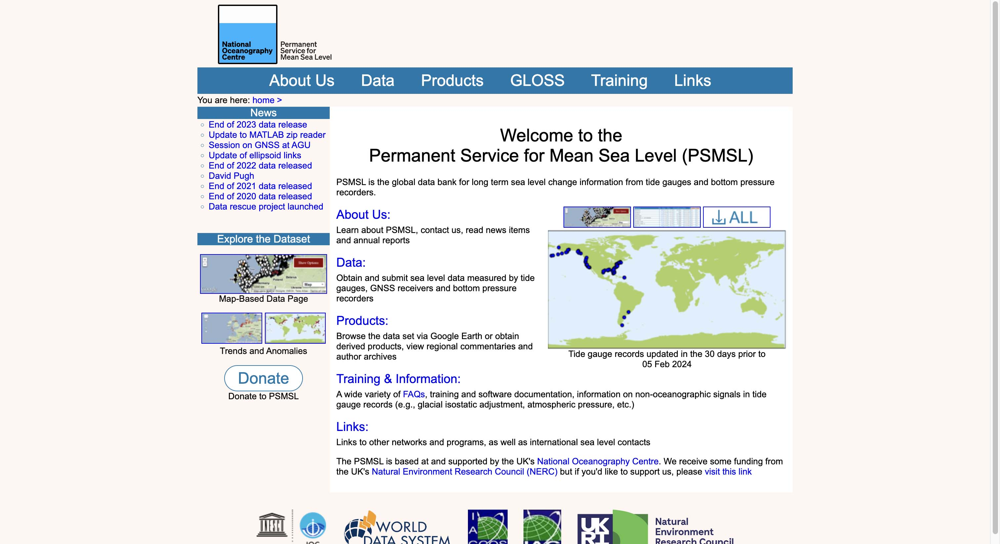
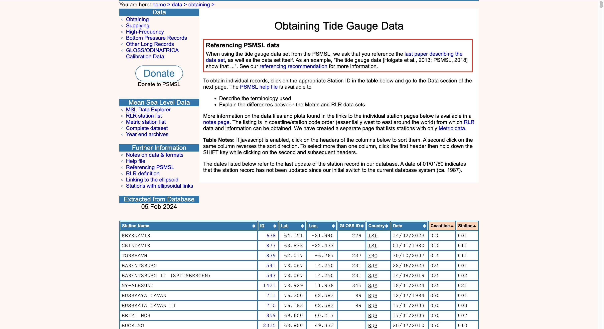
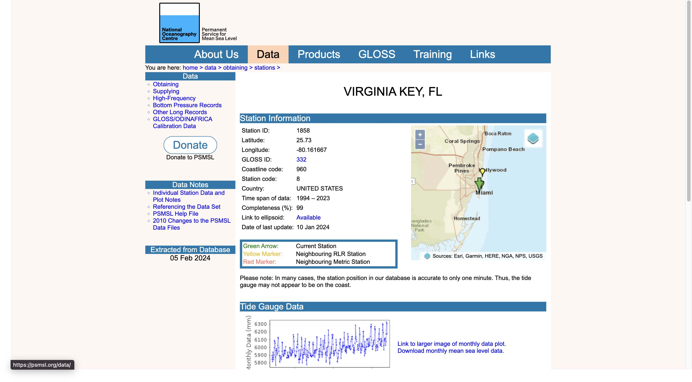
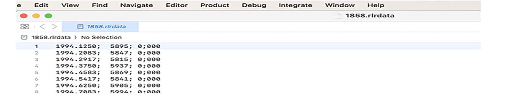
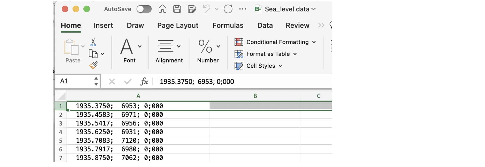

# Project-1

## Sea Level Rise Comparison Tool

## Collaborators

* Dr. Dick Davis II
* Jana Avery
* Jay Requarth
* John Andrews
* Mathew Nicholas
* Nee Buntoum
* Yeongjin Nam
  
  https://github.com/GuyInFreezer/project-1/assets/101156624/9dbab4d4-eefc-41a5-a259-cd7e63757956

## Overview

 This program provides a comparison of sea level rise between two cities. It offers detailed visualizations of historical sea level data. Additionally, it projects future trends based on various scenarios and highlights potential impacts on coastal communities, empowering users to make informed decisions regarding adaptation and mitigation strategies.

 This program was originally designed to help New Hanover County allocate funds to mediate the effect of sea level rise. All data is average monthly in the format yyyy-mm-01. All data is assumed to be on the 1st of the month. However, the program is written to compare any 2 locations in the world where sea level data is available. city1 = location 1. This sea level rise data is compared to northern hemisphere temperature. A correlation between sea level rise to northern hemisphere temperature rise city2 = location 2. The sea level rise from location 1 and location 2 are plotted, and a correlation is determined.The PSMSL.org data is used because, at some sites, sea level data is available for more than 80 years. The data utilized in this program is sourced from PSMSL.org, a reputable organization known for providing comprehensive and reliable sea level data. PSMSL.org is recognize at numerous coastal sites worldwide. The organization's commitment to data integrity and accuracy makes it a trusted source for scientific research and policy-making.

 Wilmington is among the sites monitored by PSMSL.org, with sea level data available since 1935.  Remarkably, only 17 data points are missing from this extensive dataset, ensuring a robust analysis of sea level trends in the region. The reference point established in 1970, set at -7000 mm, serves as a valuable baseline for understanding mean sea level variations over time. Missing data points, denoted by -9999, have been systematically cleaned to maintain the integrity of the analysis.

## Features

* Data Visualization: Harnesses the power of dynamic graphs and interactive maps to visually depict the evolving trends of sea level rise across temporal dimensions.
  
* City Comparison: Empowers users to juxtapose sea level rise data between two designated urban centers, fostering insightful comparisons and informed decision-making.
  
* Future Projections: Offers foresight into prospective sea level rise through the utilization of climate change models, enabling anticipation and preparedness for evolving environmental challenges.
  
* Impact Assessment: Discerns vulnerable areas susceptible to flooding and evaluates potential repercussions on both infrastructure and communities, facilitating proactive measures for resilience and adaptation.

## Installation

1. Clone this repository to your local machine.
2. Download the data from the PSMSL.org website. Go to Home page:

   
3. Click on "Data" link, then“Obtaining Tide Gauge Data:” link.

    
4. Select the Station Name or Station ID. Click on the Station ID link.

   

5. Look at “Time span of data:” and “Completeness (%)” to see if the data is of interest. If yes, click on “Download monthly mean sea level data.” hyperlink located to
the right of the sea level graph.
The data will download. Make sure Xcode is available on your computer.
To convert the data to a .csv format, open the data using the Xcode application.
You should see data that looks something like this: yyyy.mmmm; nnnn; 0;0000
yyyy = year. mmmm is a decimal format for month: mmmm=(M−0.5)/12
With M = the integer for the month. For example, April = 04. nnnn is millimeters above the reference (which was set at -7000 mm in 1970)
6. The rlrdata looks like this:

   
7. Copy and paste the data into an Excel spreadsheet. Save as “Wilmington.csv” file.

   

8. Add the Wilmington.csv file to the Resource folder. Do the same for the second city, and the third, and so on. Just before running the program, change the csv file name to city1.csv and city2.csv. Run program. When the program asks you to select the file to upload, open the Resource folder and click on city1.csv.
9. The northern hemisphere temperature data will be loaded with the “https://_______ hyperlink” imbedded in the program. This data is in the classic csv format with each row being a different year (yyyy) and each column a different month. An imbedded for-loop is used to create a 2 column dataframe with a date time in the yyyy-mm-01 format. All data is assumed to be entered for the month on the 1st of the month.When the program asks you to select the file to upload, open the Resource folder and click on the city2.csv.df = city_1.cvs df[‘date’ , ‘height’]
height variable is in mm. drop a height <= 5000, because na = -9999. The date variable was an object and it had hidden alpha-numerics: ‘\xa0  1942.5417’Remove the alpha-numerics and spaces. The first 4 digits before the decimal point is the year (yyyy). The 4 digits after the decimal point are the month. (M-0.5)/12, with M = the numerical month (April = 04). The month is determined using this
equation.new_df = a new dataframe with an index, datetime variable, and height variable. Prophet is used to predict future data.
ds: x-axis (independent variable) in datetime format: yyyy-mm-dd
y:  y-axis  (dependent variable) in an integer format.
temps from the https:// hyperlink
test_df is the new dataframe – index, ds (datetime), y (y-axis)
combined_df – inner merge of new_df file and test_df on datetime plot sea level for city1 vs Temperature rise.
Do a correlation. Upload city2 so that we can compare the 2 cities. cities_df – merge new_df and city_2_df on ds(datetime). Plot the sea level rise for the 2 cities on different y-axes and datetime on the x-axis. Check the correlation.

## Results

### Comparative Sea Level Rise Analysis

The program conducts an in-depth comparative analysis of sea level rise trends between two selected cities, offering users a granular understanding of the temporal and spatial dynamics of sea level change. Through advanced statistical methods and visualization techniques, users can explore not only the overall trends in sea level rise but also subtle variations and anomalies within each city's data. The program facilitates comparisons between cities of different geographical and climatic characteristics, providing valuable insights into the factors shaping regional sea level rise patterns.

### Future Trend Projections

Utilizing state-of-the-art climate models and scenario analyses, the program generates detailed projections of future sea level rise trends for the selected cities. These projections take into account a wide range of factors, including global temperature trends, oceanic circulation patterns, and regional geological features. By simulating various future scenarios, users can explore the potential range of sea level rise outcomes under different climate change mitigation strategies and policy interventions. Furthermore, the program provides probabilistic estimates of future sea level rise, enabling users to assess the likelihood of different scenarios and plan accordingly for future risks and uncertainties.

### Impacts on Coastal Communities

The program assesses the potential impacts of sea level rise on coastal communities, infrastructure, and ecosystems with unprecedented detail and accuracy. Through sophisticated risk assessment methodologies, users can identify vulnerable areas at risk of erosion and coastal flooding. Additionally, the program quantifies the potential economic costs and societal implications of sea level rise, taking into account factors such land use patterns, infrastructure vulnerability, and ecosystem services. By integrating socio-economic and environmental data, users can prioritize adaptation and mitigation measures accordingly.

### Flexibility and Data Integrity

Originally developed to address the specific needs of New Hanover County, the program offers unparalleled flexibility in comparing sea level data from any two locations worldwide. Leveraging the extensive and meticulously curated dataset provided by PSMSL.org, the program ensures the integrity and reliability of its analyses. The long-term nature of the sea level data, spanning several decades and encompassing a diverse range of coastal environments, enhances the robustness of the program's findings and enables meaningful comparisons between different regions and time periods. Furthermore, the program implements rigorous quality control procedures to identify and mitigate data errors and biases, ensuring that users can have confidence in the accuracy and reliability of the results.

### Conclusion

In conclusion, this program represents a paradigm shift in our ability to understand, predict, and mitigate the impacts of sea level rise on coastal communities. By providing comprehensive analyses, detailed projections, and insights into potential impacts, it empowers stakeholders to make informed decisions and take proactive measures to safeguard coastal resilience and sustainability. With its advanced analytical capabilities, flexibility, and commitment to data integrity, the program serves as a cornerstone of efforts to address the challenges posed by sea level rise and build a more resilient and adaptive future for coastal communities worldwide.

## Works Cited

1. PSMSL Data 
Permanent Service for Mean Sea Level (PSMSL). (n.d.). Data retrieved from PSMSL.org, Fortran IV data file accessed via MatLab program in Xcode, manipulated and analyzed using Pandas in Python.

2. NASA Northern Hemisphere Temperature Data NASA Goddard Institute for Space Studies. (n.d.). Northern Hemisphere Temperature Anomalies. Retrieved from https://data.giss.nasa.gov/gistemp/tabledata_v4/NH.Ts+dSST.csv

3. Energy Units Basics,
U.S. Energy Information Administration. (n.d.).  Energy Units Basics.
Retrieved from: https://www.eia.gov/kids/what-is-energy/energy-units-basics.php

4. Climate Change Indicators: Arctic Sea Ice 
United States Environmental Protection Agency. (n.d.). Climate Change Indicators: Arctic Sea Ice. Retrieved from https://www.epa.gov/climate-indicators/climate-change-indicators-arctic-sea-ice
